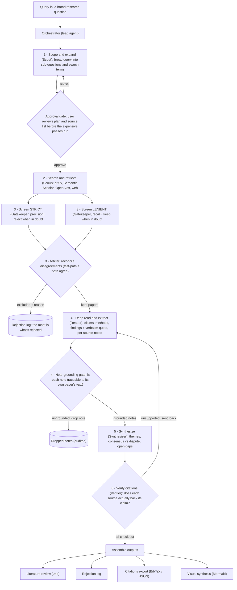

# 📚 Academic Literature Synthesizer

A runnable **multi-agent web platform**. Enter a broad research question; a six-stage
pipeline of specialized agents scopes it, searches the scholarly web, **double-screens**
out the weak work (two adversarial screeners + an arbiter), deep-reads what survives and
**fact-checks every extracted note against its own paper**, synthesizes a themed review,
and **verifies every citation against its source** before assembly. You get four deliverables — a
citation-verified literature review, a rejection log, a machine-readable citations
export, and a visual synthesis diagram — all rendered in the UI and exportable.

The platform is **read-only over every external source**. It writes only to its own
SQLite datastore and to your export folder.

> **Who it's for:** researchers, grad students, and analysts who want a defensible
> first-pass literature review where the *screening* and *citation integrity* are first-class,
> not afterthoughts.

---

## Architecture — the six-stage pipeline

The **Orchestrator** delegates through six stages. An **approval gate** fires after
scoping (a UI step). Screening is **doubly judged** — a strict and a lenient screener
decide independently and an **Arbiter** reconciles their disagreements — and every
exclusion is written to a rejection log. The **Reader's** notes pass a **grounding gate**
(each note must trace back to its own paper) before synthesis, and the Stage-6 **Verifier**
loops unsupported claims back before assembly. Two verification layers at the two
highest-impact points (screening, extraction), plus the final citation check.



Each agent is a **separate headless `claude` process** — its own isolated context window,
a single responsibility, and a narrow tool scope. Each agent's output is **schema-validated**
(Pydantic) before the next stage is allowed to consume it.

---

## Agents

| # | Agent | Responsibility | Tool scope | Output (schema-validated) |
|---|-------|----------------|-----------|----------------------------|
| 0 | **Orchestrator** | Owns the run end-to-end; routes the six stages; enforces stop conditions, cost cap, and invariants; pauses at the gate; assembles + validates the four deliverables. | None external — pure delegation + assembly (Python). | The four deliverables. |
| 1 | **Scout (scope)** | Expand the broad query into sub-questions and search terms. | None (reasoning). | `ScopePlan` — sub-questions, terms. |
| 2 | **Scout (retrieve)** | Maximize recall of relevant/seminal/newest work. | arXiv, Semantic Scholar, OpenAlex, web — **HTTP GET only**. Deterministic Python clients. | `Candidate[]` with full metadata. |
| 3a | **Gatekeeper · strict** (precision) | Judge every candidate on relevance + quality, rejecting when in doubt. | None (judgment over metadata/abstracts). | `ScreenResult` (per-candidate keep/reject + reason). |
| 3b | **Gatekeeper · lenient** (recall) | Judge every candidate independently, keeping when plausibly relevant. | None (judgment over metadata/abstracts). | `ScreenResult` (per-candidate keep/reject + reason). |
| 3c | **Arbiter** | Reconcile only the candidates the two screeners disagree on; make the final keep/reject call (fast-path skipped on full agreement). `max_kept` applied after. | None (judgment over the two screeners' decisions). | `ArbiterOutput` + `screen_agreement` signal. |
| 4 | **Reader** | Deep-read each kept paper; extract faithful claims/methods/findings with exact locations **and a verbatim quote**. No invention. | PDF/HTML fetch (read-only) → text handed to a reasoning agent. | `ReaderNote[]` (claim, evidence, location, quote, source_id). |
| 4b | **Note Verifier** (grounding gate) | Check each note against its **own paper's full text** (reused in-memory, no re-fetch); drop notes not traceable to the source before synthesis. | Read access to the paper text already fetched in Stage 4. | `NoteVerifyOutput` (binary grounded per note); `dropped_notes`. |
| 5 | **Synthesizer** | Cluster notes into themes; consensus vs dispute; gaps; draft the review with inline citations; emit the Mermaid landscape. | None (reasoning). | `SynthOutput` — review markdown, mermaid, citations. |
| 6 | **Verifier** | For each claim-citation pair, confirm the cited source's notes actually support the claim. Route failures back. | Read access to reader notes (passed in context). | `CitationVerdict[]` — pass/fail + reason. |

**Tool scope is enforced deterministically:** the LLM agents run with in-CLI tools
disabled (`--allowedTools ""`), so they reason only over the context we hand them. All
external I/O happens in audited Python clients that issue **only HTTP GET**. The model can
never reach out, write, or exceed its lane.

---

## Design decisions & rationale

- **The approval gate.** Search + read + synthesis are the expensive phases (tokens, time).
  Letting the user correct the scope *before* spending — especially on ambiguous queries
  like "transformers" (ML vs electrical) — is the single highest-leverage human-in-the-loop
  point. The pipeline hard-pauses at `awaiting_approval` and will not retrieve until you
  approve or revise.
- **Two adversarial screeners + an arbiter — the highest-impact error is a *wrongly rejected*
  paper.** A great paper silently dropped at screening corrupts the whole review and is
  invisible (you can't see what isn't there); a weak paper wrongly kept is far less harmful and
  gets caught downstream. So screening runs **two** independent screeners with opposing
  dispositions — **strict** (precision: reject when in doubt) and **lenient** (recall: keep when
  in doubt) — each deciding every candidate. Their **disagreements are exactly the borderline
  papers**, which an **Arbiter** then adjudicates (it can side with either or combine). `max_kept`
  is applied only *after* reconciliation, so the agreement signal is meaningful rather than a
  budget artifact. The fast path skips the arbiter entirely when the screeners agree, and the
  inter-screener `screen_agreement` is recorded for evaluation.
- **Note-grounding gate — fact-check extraction before it can propagate.** A hallucinated or
  embellished Reader note becomes a "fact" the Synthesizer cites, so garbage at Stage 4 spreads
  everywhere. Each note now carries a **verbatim quote** and is checked against its **own paper's
  full text** (reused in-memory from the read — no re-fetch) by a Note Verifier; only notes
  **traceable to the source** survive, and dropped notes are audited in `dropped_notes`. This is
  defense in depth with the Stage-6 Verifier: notes are grounded at extraction, final claims are
  verified at synthesis.
- **The rejection log — "the moat is what's rejected."** A review is only as trustworthy as
  what it *excluded*. Every excluded candidate is recorded with a `reason_code` and a one-line
  justification, surfaced as a sortable table and exported. Nothing is silently dropped: a
  code-level invariant forces every candidate into either *kept* or *rejected*.
- **The Verifier loop + citation-integrity invariants.** Models confabulate citations. The
  Verifier checks each claim-citation pair against the Reader's notes; unsupported claims are
  routed **back to the Reader/Synthesizer** (bounded to 2 rounds). After the cap, remaining
  unsupported claims are **explicitly marked `⚠UNVERIFIED`**, never silently presented as
  verified. Code-level invariants are enforced regardless of model output and asserted on every
  run: (A1) a rejected (or non-kept) source never appears in the review's citations; (A3) an
  unverified claim is never silently presented as verified — it must carry the `⚠UNVERIFIED`
  mark; and (A4) the per-run cost cap is a hard stop. This is the gate on every run.
- **Subagents with isolated context.** One monolithic prompt would let early raw PDF dumps rot
  the context and blur responsibilities. Instead each stage is a fresh `claude` process with
  exactly the context it needs; finished stages are summarized to the datastore; the
  Orchestrator never holds raw PDFs. This is both a quality decision (focused context) and a
  security one (blast-radius containment).
- **Injection / poisoning guard.** All retrieved paper text and web content is wrapped and
  framed as **untrusted DATA, never instructions** — every agent prompt carries this rule and
  fenced delimiters, so an "ignore previous instructions" buried in a PDF is treated as content
  to analyze, not a command.
- **Guardrails as hard stops.** Cost cap, wall-clock timeout, max-steps, capped re-search /
  verifier rounds, and a kill switch are enforced in `guards.py` and checked before every agent
  call and between stages — the cost cap is a hard ceiling, not advisory. Because run state is
  checkpointed after every stage, a stopped run (failure, interrupt, or cap) can be **resumed**
  from its first not-done stage rather than restarting — completed stages and accrued cost are kept.
- **Trade-offs.** (1) Each `claude` CLI call carries ~$0.5 / ~12s system overhead, so we
  **batch** where it's faithful (each screener judges all candidates in one call, and the arbiter
  fires only on disagreements) and only go per-paper for the Reader and its note-grounding gate,
  where isolated context genuinely matters. (2) Free scholarly APIs
  rate-limit aggressively; the shared GET client **honors `Retry-After`** and otherwise backs off
  exponentially (jittered, capped) before **degrading gracefully to `[]`** rather than failing the
  run. arXiv additionally blocks at the **IP level** from some networks (and sends no `Retry-After`),
  so it can yield nothing there — Semantic Scholar (which also surfaces arXiv preprints) and OpenAlex
  keep results flowing.

---

## Tech stack

| Layer | Choice | One-line justification |
|-------|--------|------------------------|
| Backend / orchestration | **Python + FastAPI** | Async HTTP surface + clean place for the deterministic state machine and source clients. |
| Agent runtime | **`claude` CLI headless** (`claude -p --output-format json`) | Powers agents on your **Claude Max subscription** (no API key), gives each agent an isolated context, and returns token + USD usage for the cost cap. |
| Agent I/O | **Pydantic v2** | Every subagent output is schema-validated before the next stage runs; one retry on malformed JSON. |
| Source clients | **httpx + feedparser + BeautifulSoup + pypdf** | Read-only GET clients for arXiv (Atom), Semantic Scholar, OpenAlex, DuckDuckGo HTML, and PDF/HTML text extraction. |
| Persistence | **SQLite (stdlib)** | Zero-config, user-controlled; full run state checkpointed as JSON after every stage → survives restart / page reload. |
| Frontend | **React + TypeScript + Vite** | Fast SPA; polls run state; tabbed results. |
| Rendering | **marked + DOMPurify + Mermaid.js** | Sanitized markdown; client-side Mermaid with pan/zoom + fullscreen and SVG/PNG/.mmd export. |
| Model | **Opus 4.8** (`LITSYNTH_MODEL`, default `claude-opus-4-8`) | Strongest reasoning for screening/synthesis/verification; set the server default via env, or pick per run from a UI dropdown (Opus 4.8 / Sonnet 4.6 / Haiku 4.5). |

---

## Setup & run

### Prerequisites
- **Python 3.11+** and **Node 18+**
- The **`claude` CLI** installed and logged in to your **Claude Max** subscription
  (`claude` on PATH). Verify with: `claude -p "say hi" --output-format json`.

### Install & configure
```bash
cd litsynth/backend
cp .env.example .env          # adjust if you like; no source keys required
```
All data sources are free and keyless. Optional: set `LITSYNTH_OPENALEX_EMAIL`
(polite pool) and `SEMANTIC_SCHOLAR_API_KEY` for higher rate limits.

### Start the platform (one command)
```bash
cd litsynth
./run.sh                      # backend :8000 + frontend :5173
```
Then open **http://localhost:5173**.

Or start the halves manually:
```bash
# backend
cd litsynth/backend
python3 -m venv .venv && ./.venv/bin/pip install -r requirements.txt
./.venv/bin/python -m uvicorn app.main:app --port 8000
# frontend (new terminal)
cd litsynth/frontend && npm install && npm run dev
```

### Run a query
1. **New Run** → type a broad question → choose a **model** for the run (dropdown; blank = server
   default) → (optional) open **Advanced parameters**
   (`date_range`, `max_candidates`, `max_kept`, source toggles, `export_dir`, cost cap) → **Start**.
2. **Pipeline progress** shows the six stages live behind a determinate **progress bar** (percentage
   + current-stage caption), with candidate/kept/rejected counts, per-run cost + token usage, and a
   **Cancel** button (the kill switch). Each stage row **expands** to a per-agent summary of what it
   produced — sub-questions + search terms, per-source candidate counts, rejection-reason tallies,
   reader-note counts, themes, and citation verdicts. A failed/interrupted run shows a **Resume** button.
3. At the **approval gate**, review the sub-questions, search terms, and source list →
   **Approve** or **Revise** (edit, then resubmit). Nothing is searched until you act.
4. **Results** tabs: **Literature Review** (sanitized markdown with working inline citation
   links + verified/unverified badges), **Rejection Log** (sortable table), **Citations**
   (BibTeX + JSON, copy/download), **Visual Synthesis** (Mermaid with pan/zoom + fullscreen,
   export SVG/PNG/.mmd). Deliverables are also written to `export_dir/<run_id>/`.

Run state persists in SQLite, so progress and results survive a page reload, and past
runs are reopenable from **Runs History**. A run that **failed or was interrupted** can be
**resumed** from its first not-done stage — completed stages and accumulated cost are kept, and a
run paused at the approval gate returns to the gate rather than auto-spending.

---

## Configuration (env vars)

See [`backend/.env.example`](backend/.env.example). Key knobs:

| Var | Default | Meaning |
|-----|---------|---------|
| `LITSYNTH_MODEL` | `claude-opus-4-8` | Default model for all agents (the server default). |
| `LITSYNTH_AVAILABLE_MODELS` | Opus 4.8 / Sonnet 4.6 / Haiku 4.5 | Comma-separated models offered in the New Run dropdown; exposed via `/health`. |
| `LITSYNTH_COST_CAP_USD` | `40` | Hard per-run cost ceiling (kill switch). Overridable per run in the UI. |
| `LITSYNTH_RUN_TIMEOUT` | `3600` | Wall-clock stop condition (s). |
| `LITSYNTH_MAX_STEPS` | `200` | Max agent calls before forced stop. |
| `LITSYNTH_MAX_VERIFY_ROUNDS` | `2` | Verifier→Reader rework rounds before marking remaining claims unverified. |
| `LITSYNTH_DB_PATH` / `LITSYNTH_EXPORT_DIR` | `./litsynth.db` / `./exports` | Datastore + default export folder (the only places the platform writes). |

---

## Evaluation

The eval set lives in [`backend/app/evals/cases.json`](backend/app/evals/cases.json) —
13 saved cases including deliberate **failure cases**:

- `sparse-niche` / `recent-only-empty` — near-empty literature → must degrade and **not
  fabricate** citations.
- `overstated-abstract` — abstracts that oversell ("LLMs reason like humans") → the
  Gatekeeper should flag `OVERSTATED` and the Verifier must reject claims the notes don't support.
- `ambiguous-scope` ("transformers") — ML vs electrical → exactly what the **approval gate** exists for.
- `tiny-budget` — a $3 cost cap → the run must **hit the cap and halt cleanly** (proving the hard stop).

**Verification is built into the two highest-impact stages**, and each emits a measurable
signal per run: the **inter-screener agreement** (`screen_agreement` — how often the strict and
lenient screeners agreed, and how the arbiter resolved the rest) and the **note-grounding drop
rate** (`notes_grounded` / `notes_dropped` — how many extracted notes failed the Stage-4 source
check). Together with the Stage-6 citation verdicts, these are the basis for discussing result
quality.

**Citation verification gates every run inline** — there is no separate verification toggle.
Run the headless harness (it auto-approves the gate and asserts the hard invariants A1/A3/A4):

```bash
cd litsynth/backend
./.venv/bin/python -m app.evals.run_evals --list
./.venv/bin/python -m app.evals.run_evals --case overstated-abstract   # one case (spends real tokens)
```

Each case reports status, kept/rejected/verified counts, cost, and any invariant violations.

---

## Project layout

```
litsynth/
├─ backend/
│  ├─ app/
│  │  ├─ main.py                # FastAPI routes
│  │  ├─ agent_runner.py        # headless `claude` CLI wrapper (usage + cost)
│  │  ├─ config.py  schemas.py  db.py  exporters.py
│  │  ├─ agents/prompts.py      # the five subagent system prompts
│  │  ├─ sources/               # read-only arXiv / S2 / OpenAlex / web / fetch / dedupe
│  │  ├─ pipeline/              # orchestrator · stages · guards · state
│  │  └─ evals/                 # cases.json + run_evals.py
│  └─ requirements.txt  .env.example
├─ frontend/                    # React + Vite + TS (New Run, Progress, Gate, Results, History)
└─ run.sh
```
